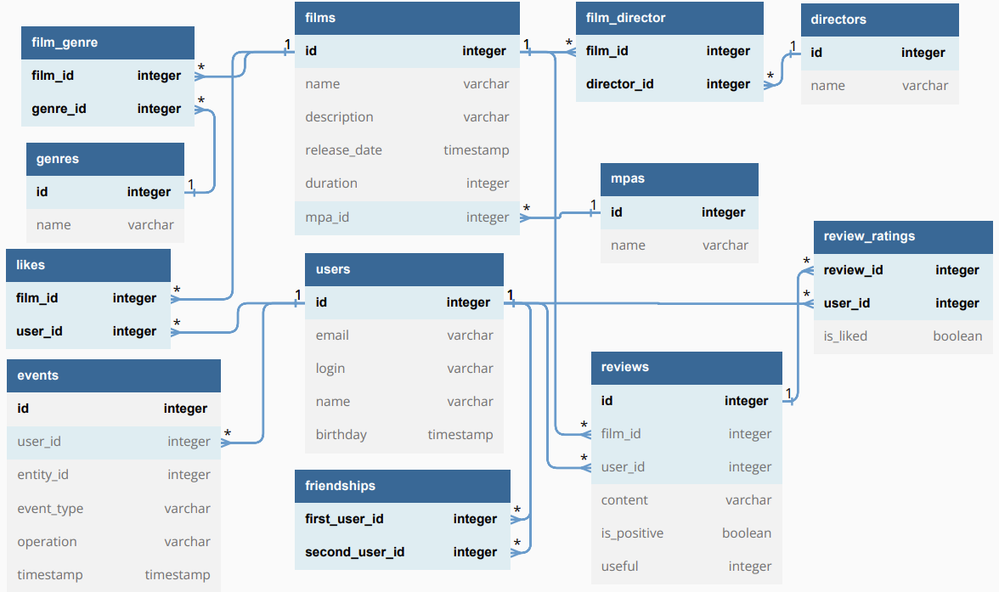

# :film_projector: Filmorate

**Filmorate** - бэкенд для сервиса, который работает с фильмами и оценками пользователей,
а также возвращает топ-5 фильмов, рекомендованных к просмотру

## :bulb: Использование

### Работа с пользователями

- ```POST /users``` - добавление пользователя
- ```PUT /users``` - обновление пользователя
- ```GET /users``` - получение всех пользователей
- ```PUT /users/{id}/friends/{friendId}```  — добавление в друзья.
- ```DELETE /users/{id}/friends/{friendId}``` — удаление из друзей.
- ```GET /users/{id}/friends``` — список друзей пользователя.
- ```GET /users/{id}/friends/common/{otherId}``` — список друзей, общих с другим пользователем.

### Работа с фильмами

- ```POST /films``` - добавление фильма
- ```PUT /films``` - обновление фильма
- ```GET /films``` - получение всех фильмов
- ```PUT /films/{id}/like/{userId}```  — пользователь ставит лайк фильму.
- ```DELETE /films/{id}/like/{userId}```  — пользователь удаляет лайк.
- ```GET /films/popular?count={count}``` — возвращает список из первых count фильмов по количеству лайков. Если значение параметра count не задано, верните первые 10.

## :floppy_disk: База данных сервиса
### ER-диаграмма базы данных Filmorate:


## :scroll: Описание

### films

Содержит информацию о фильмах
- первичный ключ `id` - идентификатор фильма;
- `name` - название фильма;
- `description` - описание фильма;
- `release_date` - дата выхода фильма;
- `duration` - длительность фильма;
- внешний ключ `mpa_id` (отсылает к таблице `mpas`) — идентификатор рейтинга фильма;

### mpas

Содержит инфрормацию о рейтинге Ассоциации кинокомпаний (англ. Motion Picture Association,
сокращённо МРА). Эта оценка определяет возрастное ограничение для фильма
- первичный ключ `id` - идентификатор рейтинга ;
- `name` - название рейтинга, например:
  - G — у фильма нет возрастных ограничений,
  - PG — детям рекомендуется смотреть фильм с родителями,
  - PG-13 — детям до 13 лет просмотр не желателен,
  - R — лицам до 17 лет просматривать фильм можно только в присутствии взрослого,
  - NC-17 — лицам до 18 лет просмотр запрещён.

### film_genre

Содержит информацию о том, какие жанры из таблицы `genres` относятся к фильму.
Таблица включает поля:
- составной первичный и внешний ключ `film_id` (отсылает к таблице `films`) - идентификатор фильма;
- составной первичный и внешний ключ `genre_id` (отсылает к таблице `genres`) - идентификатор жанра;

### genres

Содержит инфрормацию о жанрах фильмов
- первичный ключ `id` - идентификатор жанра ;
- `name` - название жанра, например:
  - Комедия.
  - Драма.
  - Мультфильм.
  - Триллер.
  - Документальный.
  - Боевик.

### users

Содержит инфрормацию о пользователях
- первичный ключ `id` - идентификатор пользователя;
- `email` - электронная почта пользователя;
- `login` - логин пользователя;
- `user_name` - имя пользователя;
- `birthday` - дата рождения пользователя;

### likes

Содержит информацию о том, какой пользователь из таблицы `users` поставил лайк
фильму из таблицы `films`. Таблица включает поля:
- составной первичный и внешний ключ `film_id` (отсылает к таблице `films`) - идентификатор фильма;
- составной первичный и внешний ключ `user_id` (отсылает к таблице `users`) - идентификатор пользователя;

### friendships

Содержит информацию о статусах дружбы между пользователями из таблицы
`users`. Таблица включает поля:
- составной первичный и внешний ключ `first_user_id` (отсылает к таблице `users`) - идентификатор пользователя №1;
- составной первичный и внешний ключ `second_user_id` (отсылает к таблице `users`) - идентификатор пользователя №2;

### film_director

Содержит информацию о том, какие режиссёры из таблицы `directors` относятся к фильму.
Таблица включает поля:
- составной первичный и внешний ключ `film_id` (отсылает к таблице `films`) - идентификатор фильма;
- составной первичный и внешний ключ `director_id` (отсылает к таблице `directors`) - идентификатор режиссёра;

### directors

Содержит инфрормацию о режиссёрах фильмов
- первичный ключ `id` - идентификатор режиссёра ;
- `name` - имя режиссёра;

### reviews

Содержит информацию об отзывах, относящихся к фильмам.
Таблица включает поля:
- первичный ключ `id` - идентификатор отзыва;
- `film_id` (отсылает к таблице `films`) - идентификатор фильма;
- `user_id` (отсылает к таблице `users`) - идентификатор пользователя, оставившего отзыв;
- `content` - текст отзыва;
- `is_positive` - статус отзыва (false - отрицательный, true - положительный);
- `useful` - рейтинг полезности отзыва.

### review_ratings

Содержит информацию о пользовательских оценках отзывов.
- составной первичный и внешний ключ `review_id` (отсылает к таблице `reviews`) - идентификатор отзыва;
- составной первичный и внешний ключ `user_id` (отсылает к таблице `users`) - идентификатор пользователя, поставившего оценку;
- `is_liked` - статус оценки (false - дизлайк, true - лайк).

### events

Содержит информацию о событиях на платформе: добавление в друзья, удаление из друзей, лайки и отзывы, которые оставил пользователь.
Таблица включает поля:
- первичный ключ `id` - идентификатор события;
- `user_id` (отсылает к таблице `users`) - идентификатор пользователя - инициатора события;
- `entity_id` (отсылает к таблице `films`/`users`/`reviews` в зависимости от типа события) - идентификатор сущности;
- `event_type` - тип события ("LIKE", "REVIEW" или "FRIEND");
- `operation` - тип операции ("REMOVE", "ADD" или "UPDATE");
- `timestamp` - временная метка, когда произошло событие.